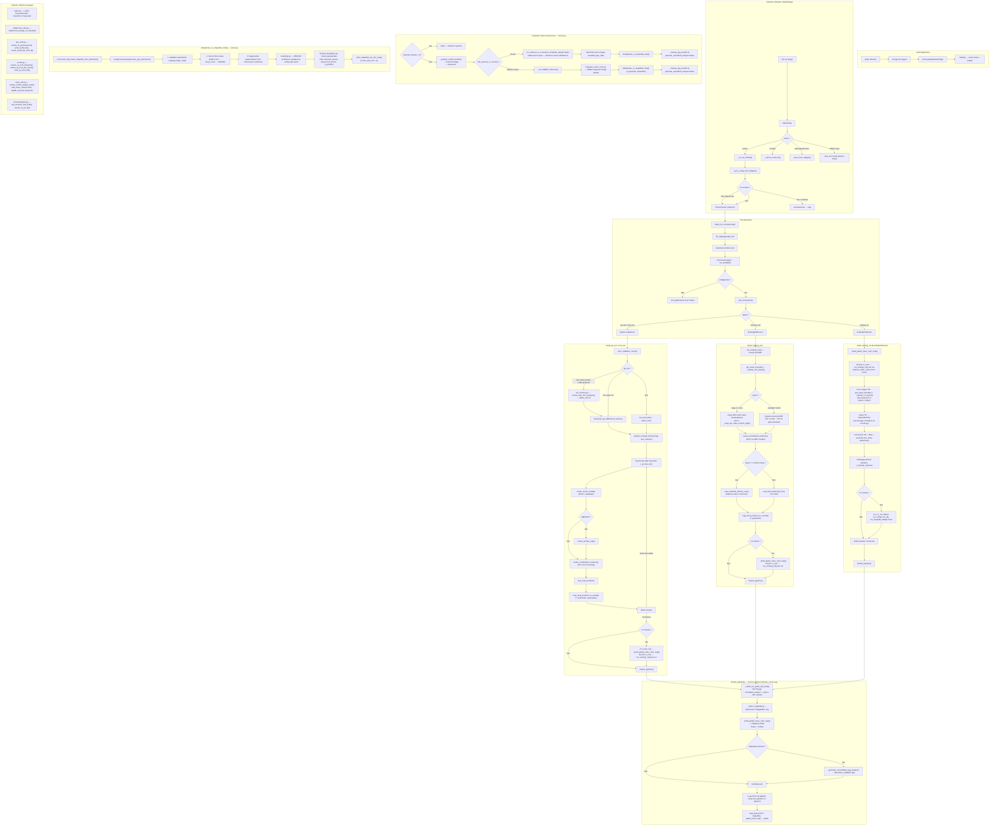

# Archeolog'IA pipeline (Plugin QGIS)

Plugin QGIS pour exécuter un pipeline de traitement LiDAR et produire des rasters de type MNT / densité / indices RVT, avec une étape optionnelle de détection / segmentation par *computer vision*.

- Nom du plugin : **ArchéologIA**
- Version : **0.2.0**
- QGIS minimum : **3.0**

## Fonctionnalités

- Génération de produits raster :
  - **MNT**
  - **Densité**
  - Indices **RVT** (via *Processing*) : **M-HS**, **SVF**, **SLO**, **LD**, **VAT**
- Export optionnel en **JPG + world file (JGW)** pour certains produits.
- (Optionnel) Détection / segmentation d'instances par computer vision à partir des JPG produits (via runner externe ou dépendances Python) :
  - **Multi-modèles** : plusieurs modèles peuvent être configurés en parallèle, chacun ciblant un RVT différent.
  - **Sélection de classes** par modèle : cocher/décocher les classes à détecter par modèle. Si toutes les classes d'un modèle sont décochées, l'inférence est ignorée pour ce modèle (court-circuit avant toute inférence).
  - **Filtrage par aire minimale** (`min_area_m2`) par modèle : les détections trop petites sont écartées dans un shapefile séparé (`detections_filtered_too_small.shp`).
  - **Post-processing global** (appliqué après toutes les inférences, avant génération des shapefiles) :
    - Fusion des polygones de même classe qui se touchent ou sont séparés par ≤ 0.5 m (y compris **inter-dalles**), avec confiance = moyenne pondérée par l'aire des polygones sources.
    - Suppression des superpositions inter-classes (le polygone le plus confiant conserve sa géométrie, les autres sont découpés).
  - **Clustering spatial DBSCAN** (optionnel, par modèle) : regroupe les détections individuelles en zones (ex : `cratere_obus` → `zone_crateres`), configurable via `args.yaml` du modèle.
  - **Nettoyage automatique** du workdir JPG (`detections/<modele>/jpg/`) si *Générer des images annotées* est désactivé.
- **Projet QGIS consolidé** : un seul fichier `.qgs` multi-modèles est généré à la racine de `detections/` (`detections_validation.qgs`).
- Option (configurable) : génération de **pyramides / overviews** GDAL pour les GeoTIFF de sortie.

## Modes de données supportés

Le pipeline peut être lancé dans plusieurs modes (selon l’UI/config) :

- `ign_laz` : téléchargement/consommation de tuiles LAZ depuis l'IGN (à partir d'un polygone de zone ou d'une liste de dalles).
- `local_laz` : consommation de tuiles LAZ/LAS déjà présentes localement.
- `existing_mnt` : calcul d'indices RVT à partir d'un MNT existant. Supporte les MNT au format dalle IGN 1 km (ex. `LHD_FXX_xxxx_yyyy_*`), les MNT plus petits (< 1 km, emprise native conservée) **et les MNT de grande emprise** (plusieurs km²) qui sont traités **d'un seul bloc** : les indices RVT sont calculés sur le raster complet et SAHI assure le slicing 640 × 640 à l'inférence CV. Voir la section [MNT / RVT non-IGN](#mnt--rvt-non-ign--traitement-des-grandes-emprises).
- `existing_rvt` : opérations sur RVT existants (TIF). Dans ce mode, le dossier de sortie est `indices/RVT/` (nom générique) ; dans les autres modes, le nom du dossier correspond à l'indice cible (`LD`, `SVF`, etc.). Comme pour `existing_mnt`, les rasters RVT de grande emprise sont **traités sans pré-découpage** : la limite PIL `MAX_IMAGE_PIXELS` est désactivée et SAHI découpe l'image en mémoire au moment de l'inférence.

## Pré-requis

Le plugin s’exécute dans QGIS et s’appuie sur des outils externes. Un contrôle est effectué au lancement via le **préflight**.

### Dépendances QGIS

- **QGIS 3.x**
- Module **Processing** (fourni avec QGIS)
- Les algorithmes RVT accessibles via Processing (selon installation QGIS)

### Outils externes (CLI)

- **PDAL** (`pdal`) requis pour les modes `ign_laz` et `local_laz`
- **GDAL** utilitaires :
  - `gdalwarp` requis pour `ign_laz`, `local_laz`, `existing_mnt`
  - `gdal_translate` requis pour `existing_mnt` / `existing_rvt`
  - `gdaladdo` optionnel (pyramides / overviews). Si absent, la génération de pyramides est ignorée

### Computer vision (optionnel)

Deux options pour l'**inférence** :

- **Runner ONNX externe** (recommandé) : `data/third_party/cv_runner_onnx/windows/cv_runner_onnx.exe` (Windows) / `data/third_party/cv_runner_onnx/linux/cv_runner_onnx` (Linux)
  - Le runner externe ne fait **que l'inférence** (JSON/TXT + images annotées). La génération des shapefiles et le post-processing global sont toujours réalisés côté plugin Python.
- Ou dépendances Python dans l'environnement de QGIS (si pas de runner externe) :
  - `onnxruntime`, `sahi`, `PIL` (Pillow)

Pour la **génération de shapefiles et le post-processing global** (fusion polygones, suppression superpositions), le plugin Python requiert :
- `shapely` (opérations géométriques : union, buffer, difference)
- `geopandas` + `fiona` (écriture shapefiles)

Ces dépendances sont disponibles dans l'environnement QGIS standard.

**Note** : Les modèles doivent être exportés au format ONNX avant utilisation (voir section dédiée).

## Installation

### Installation dans QGIS (utilisateur)

1. Ouvrir **QGIS**.
2. Aller dans :
   - `Profils utilisateurs` → `Ouvrir le dossier du profil actif`
3. Ouvrir le dossier :
   - `python/plugins`
4. Dézipper le plugin : on obtient le dossier :
   - `archeologia-pipeline-lidar-processing`
5. Copier le dossier `archeologia-pipeline-lidar-processing` dans `python/plugins`.
6. Fermer puis relancer QGIS.
7. Activer le plugin :
   - `Extensions` → `Installer/Gérer les extensions…` → rechercher **Archeolog'IA pipeline** → activer.

### Où se trouve le dossier des plugins

Sous Windows (profil par défaut) :

```text
%APPDATA%\QGIS\QGIS3\profiles\default\python\plugins\
```

### Dépendances à avoir dans QGIS

Le plugin exécute un **préflight** (contrôle des dépendances) au lancement.

- **Processing** : doit être disponible (dans QGIS : `Traitement` → `Boîte à outils`).
- **Algorithmes RVT via Processing** : nécessaires si tu actives des produits RVT (M-HS/SVF/SLO/LD/VAT).

Si un élément est manquant, le préflight affichera une erreur et empêchera le lancement.

### Dépendances externes (CLI)

Certaines étapes reposent sur des exécutables dans le `PATH` :

- `pdal` requis pour `ign_laz` / `local_laz`
- `gdalwarp` requis pour `ign_laz` / `local_laz` / `existing_mnt`
- `gdal_translate` requis pour `existing_mnt` / `existing_rvt`
- `gdaladdo` optionnel (pyramides / overviews). Si absent, la génération de pyramides est ignorée

## Computer vision : runner ONNX + modèles

### Activer la computer vision

La computer vision est optionnelle. Quand elle est activée, le pipeline peut lancer une étape de détection à partir des images (JPG) exportées.

Le plugin utilise un **runner ONNX unifié** qui supporte les types de modèles suivants :

| Type | Tâche | Format fichier |
|---|---|---|
| **YOLO** | Détection d'objets | `.onnx` |
| **RF-DETR** | Détection d'objets | `.onnx` |
| **RF-DETR Seg** | Segmentation d'instances | `.onnx` |
| **SegFormer** | Segmentation sémantique | `.onnx` |
| **SMP** (DeepLabV3+, Unet…) | Segmentation sémantique | `.onnx` |

### Export des modèles vers ONNX

Avant d'utiliser le runner, vous devez exporter vos modèles PyTorch (.pt/.pth) vers le format ONNX.

#### 1. Créer un environnement virtuel dédié à l'export

```bash
cd <racine_du_plugin>
python -m venv .venv_export

# Windows
.venv_export\Scripts\activate

# Linux/Mac
source .venv_export/bin/activate
```

#### 2. Installer les dépendances d'export

**Pour YOLO uniquement :**
```bash
pip install ultralytics onnx onnxsim
```

**Pour RF-DETR uniquement :**
```bash
pip install rfdetr torch onnx onnxsim pyyaml
```

**Pour SMP (DeepLabV3Plus, Unet, etc.) :**
```bash
pip install segmentation-models-pytorch torch onnx onnxsim pyyaml
```

**Complet (tous les types) :**
```bash
pip install ultralytics rfdetr segmentation-models-pytorch torch onnx onnxsim pyyaml
```

#### 3. Exporter le modèle

```bash
# Exporter un modèle YOLO
python dev\runner_onnx\export_to_onnx.py --model models\mon_modele\weights\best.pt --output models\mon_modele\weights\best.onnx

# Exporter un modèle RF-DETR (détection)
python dev\runner_onnx\export_to_onnx.py --model models\mon_modele_rfdetr\weights\best.pth --output models\mon_modele_rfdetr\weights\best.onnx --type rfdetr --imgsz 560

# Exporter un modèle RF-DETR Seg (segmentation d'instances)
# Les paramètres patch_size et positional_encoding_size sont lus automatiquement depuis le checkpoint ;
# les spécifier explicitement si la détection automatique échoue.
python dev\runner_onnx\export_to_onnx.py \
  --model models\mon_modele_rfdetr_seg\weights\best.pth \
  --output models\mon_modele_rfdetr_seg\weights\best.onnx \
  --type rfdetr \
  --imgsz 1032 \
  --patch-size 12 \
  --positional-encoding-size 42

# Exporter un modèle SMP (DeepLabV3Plus)
python dev\runner_onnx\export_to_onnx.py \
  --model models\mon_modele_smp\weights\best.pth \
  --output models\mon_modele_smp\weights\best.onnx \
  --type smp \
  --arch DeepLabV3Plus \
  --encoder resnet101 \
  --num-classes 3 \
  --class-names "background,parcellaire,talus-fosse_fossebutte" \
  --imgsz 512
```

Le script détecte automatiquement le type de modèle (YOLO, RF-DETR, RF-DETR Seg, SegFormer ou SMP).

### Création du runner ONNX (Windows)

Objectif : produire un exécutable :

```text
data/third_party/cv_runner_onnx/windows/cv_runner_onnx.exe
```

#### Compilation automatique

Le script `runner_onnx/build.py` automatise la création du runner :

```bash
cd runner_onnx

# Compiler le runner (CPU)
python build.py

# Compiler le runner avec support GPU
python build.py --gpu

# Nettoyer les builds précédents
python build.py --clean
```

Le script :
1. Crée un environnement virtuel isolé (`.venv_onnx`)
2. Installe les dépendances nécessaires
3. Compile le runner avec PyInstaller
4. Copie le binaire vers `data/third_party/cv_runner_onnx/windows/`

**Taille du binaire** : ~100-150 MB (inclut les dépendances SAHI et ONNX Runtime)

#### Compilation manuelle (alternative)

```bash
cd runner_onnx
python -m venv .venv_onnx
.venv_onnx\Scripts\activate
pip install pyinstaller onnxruntime sahi pillow numpy pyyaml
python -m PyInstaller --clean cv_runner_onnx.spec
copy dist\cv_runner_onnx.exe ..\..\data\third_party\cv_runner_onnx\windows\
```

> **Note** : `shapely`, `geopandas` et `fiona` ne sont **pas** nécessaires dans le runner. La génération de shapefiles et le post-processing sont réalisés côté plugin Python (QGIS).

### Modèles (dossier `data/models/`)

Tous les modèles sont placés dans `data/models/` à la racine du plugin (dossier gitignored). Structure attendue (1 modèle = 1 dossier) :

```text
data/
  models/
    <nom_du_modele>/
      args.yaml              # Paramètres du modèle (imgsz, task, sahi config, clustering…)
      classes.txt            # Un nom de classe par ligne (sans background)
      config.json            # Métadonnées entraînement (architecture, classes, hyperparamètres)
      weights/
        best.pt / best.pth   # Modèle PyTorch original
        best.onnx            # Modèle exporté (requis pour le runner)
        best.json            # Métadonnées ONNX (type, tâche, résolution, classes)
  third_party/
    cv_runner_onnx/
      windows/
        cv_runner_onnx.exe   # Runner ONNX compilé (Windows)
      linux/
        cv_runner_onnx       # Runner ONNX compilé (Linux)
```

Le fichier `classes.txt` doit contenir **un nom de classe par ligne** (sans classe background) :

```text
nomclasse1
nomclasse2
...
```

Le fichier `args.yaml` décrit les paramètres d'inférence. Exemple pour un modèle RF-DETR Seg avec clustering :

```yaml
imgsz: 1032
model: RF-DETR-Seg-Large
task: instance_segmentation
sahi:
  overlap_ratio: 0.2
  slice_height: 1032
  slice_width: 1032
clustering:
  - target_classes: ["cratere_obus"]
    eps_m: 25
    min_cluster_size: 3
    min_samples: 2
    min_confidence: 0.1
    output_class_name: "zone_crateres"
    output_geometry: convex_hull
    buffer_m: 5
    confidence_weight: 0.5   # 0.0 = DBSCAN classique
```

Valeurs possibles pour `task` : `detect`, `instance_segmentation`, `semantic_segmentation`.

Le clustering DBSCAN est optionnel. Si la section `clustering` est absente de `args.yaml`, il est désactivé. Les classes générées par clustering contournent le filtre `selected_classes` et sont toujours incluses dans les shapefiles.

### Configuration

Dans `config.json`, le modèle doit pointer vers le fichier `.onnx` :

```json
{
  "cv": {
    "enabled": true,
    "selected_model": "models/mon_modele/weights/best.onnx"
  }
}
```

Ou vers le dossier du modèle (le runner cherchera automatiquement `best.onnx`) :

```json
{
  "cv": {
    "enabled": true,
    "selected_model": "mon_modele"
  }
}
```

## MNT / RVT non-IGN : traitement des grandes emprises

Les modes `existing_mnt` et `existing_rvt` ne se limitent pas aux dalles IGN LiDAR HD 1 km. Le pipeline inspecte les **bornes géographiques** de chaque raster d'entrée (Lambert-93) puis choisit un flux adapté :

| Régime | Condition (tolérance 50 m) | Traitement |
|---|---|---|
| **standard** | ≈ 1 000 × 1 000 m **et** aligné sur la grille IGN | Comportement d'origine (crop 1 km, renommage `LHD_FXX_{x}_{y}_*`). |
| **small** | < 1 km ou non aligné sur la grille | Aucun crop : l'emprise native est préservée (évite d'introduire du NoData). Nommage IGN conservé pour la dédup et la conversion shapefile. |
| **large** | largeur **ou** hauteur > 1,05 km | **Pas de pré-découpage**. Les indices RVT sont calculés sur l'emprise complète, puis SAHI assure le slicing 640 × 640 en mémoire au moment de l'inférence CV. |

Conséquences pratiques pour le régime **large** :

- **Indices RVT continus** : un MNT 7 × 5 km produit un unique GeoTIFF `LD`, `SVF`, etc. couvrant toute la scène, sans discontinuités sur les bords de sous-dalles. Les algorithmes RVT (angle, voisinage) bénéficient ainsi de l'intégralité du contexte local.
- **Pas de sous-dalles NoData** : on évite le problème des cellules 1 km à l'extérieur de la couverture réelle du LiDAR qui se retrouvaient sinon rendues en noir dans QGIS.
- **Limite PIL désactivée** : `Image.MAX_IMAGE_PIXELS = None` est positionné dans `src/pipeline/ign/products/convert_tif_to_png.py` et `src/pipeline/cv/computer_vision_onnx.py` pour autoriser le chargement d'un grand TIF/PNG. À l'usage interne uniquement (rasters locaux maîtrisés).
- **SAHI gère le slicing** : le raster est lu une fois en numpy, puis `sahi_lite.slice_image()` produit les tuiles 640 × 640 avec chevauchement (`overlap_ratio=0.2` par défaut). Les détections de chaque tuile sont décalées vers l'espace image global puis fusionnées (NMS). Le nom du fichier est conservé, donc une seule entrée apparaît dans `tif_transform_data` pour le géoréférencement des bounding boxes.
- **Consommation RAM** : un PNG 20 000 × 20 000 RGB = 1,2 Go en numpy ; les slices SAHI ajoutent ~50-100 Mo selon l'overlap. Compter **~3 Go de pic** pour une scène 10 × 10 km à 0,5 m/px.
- **Le nom de sortie reprend le stem du fichier source** : un MNT `mon_site.tif` produit `mon_site_LD.tif`, `mon_site_SVF.tif`, etc. (les caractères non alphanumériques sont convertis en `_` pour la compatibilité GDAL, et un éventuel suffixe `_MNT` est retiré pour éviter `*_MNT_MNT.tif`).

> La logique se trouve dans `src/pipeline/modes/existing_mnt.py` (`_classify_mnt_layout`, `_large_tile_name_for`) et `src/pipeline/modes/existing_rvt.py` (`_classify_rvt_layout`). Le module `src/pipeline/ign/products/tile_splitter.py` reste disponible pour des cas explicites où un découpage en dalles IGN serait souhaité (il n'est plus déclenché automatiquement par le régime `large`).

## Sorties

Les sorties sont écrites dans le dossier `output_dir` configuré.

Structure typique (modes `local_laz` / `ign_laz` / `existing_mnt`) :

```text
output_dir/
  metadata.json                          # Résumé du run (version, dalles, produits, runs CV)
  pipeline_log_<date>.txt               # Log complet du run
  sources/
    dalles/                             # Fichiers LAZ/LAS sources (mode local_laz)
  indices/
    MNT/
      tif/                             # GeoTIFF MNT
      jpg/                             # JPG + world files (si activé)
    LD/                                # Nom = indice cible du run CV
      tif/
      jpg/
    SVF/
      tif/
      jpg/
  detections/
    detections_validation.qgs          # Projet QGIS consolidé (unique, multi-modèles)
    <nom_modele>/                      # Dossier par modèle
      shapefiles/                      # Shapefiles par classe (avec clustering si activé)
        detections_LD_parcellaire.shp
        detections_LD_talus-fosse_fossebutte.shp
        detections_filtered_too_small.shp
      jpg/                             # Workdir inférence (supprimé si images annotées désactivées)
```

En mode `existing_rvt`, le dossier d'indices est `indices/RVT/` (nom générique).

Les GeoTIFF peuvent contenir des **overviews** si l'option pyramides est activée et si `gdaladdo` est disponible.

## Développement

- Point d’entrée plugin : `main.py` (classe `ArcheologiaPipelinePlugin`)
- UI : `src/ui/main_dialog.py`
- Pipeline : `src/pipeline/`
  - prérequis : `src/pipeline/preflight.py`

## Git : Talisman (pre-push)

Le dépôt inclut un hook `pre-push` basé sur **Talisman** pour éviter de pousser des secrets (tokens, clés, etc.).

### Installation de Talisman

Installe `talisman` et assure-toi qu’il est disponible dans le `PATH`.

### Activer les hooks du dépôt

Les hooks Git ne sont pas versionnables directement dans `.git/hooks/`. À la place, ce dépôt fournit un dossier `.githooks/`.

À exécuter **à la racine du dépôt** :

```bash
git config core.hooksPath .githooks
```

Ensuite, un `git push` déclenchera automatiquement Talisman et pourra bloquer le push si un secret est détecté.

## Dépannage

- **Préflight KO** : vérifier que `pdal`, `gdalwarp`, `gdal_translate` sont accessibles dans le `PATH`.
- **Pyramides absentes** : vérifier la présence de `gdaladdo` et que l’option pyramides est activée.
- **RVT indisponible** : vérifier que les algorithmes RVT sont disponibles via QGIS Processing.
- **Computer vision** :
  - soit fournir le runner externe dans `third_party/cv_runner_onnx/...`
  - soit installer les dépendances Python (`onnxruntime`, `pillow`) dans l'environnement QGIS
  - les modèles doivent être exportés en ONNX **avant** utilisation (voir section dédiée)
  - pour les modèles RF-DETR Seg, `opencv-python` est requis dans le runner (inclus dans le binaire compilé)
- **Post-processing non appliqué** : vérifier que `shapely` et `geopandas` sont disponibles dans l'environnement Python de QGIS. Le runner externe ne fait que l'inférence ; la fusion de polygones et la génération de shapefiles sont réalisées côté plugin Python.
- **Polygones non fusionnés entre dalles** : le post-processing global fusionne les polygones de même classe séparés par ≤ 0.5 m. Si les polygones ne sont pas fusionnés, vérifier que les fichiers de détection (`.txt`/`.json`) de toutes les dalles sont présents dans le même dossier `jpg/`.
- **Détections bbox au lieu de polygones** : vérifier que le fichier `weights/best.json` du modèle contient bien `"task": "instance_segmentation"` pour les modèles RF-DETR Seg
- **Pipeline bloqué au démarrage** : si beaucoup de fichiers TIF/JPG (>1000), la première exécution peut prendre plusieurs minutes pour créer les liens/copies vers les dossiers modèles — c'est normal
- **Classes non filtrées** : vider les fichiers `.txt`/`.json` existants dans le dossier `jpg/` du modèle si les anciens résultats ont été générés sans filtrage de classes
- **Inférence lancée malgré 0 classe cochée** : s'assurer que `selected_classes` est bien une liste vide `[]` dans la config et non `null` — le court-circuit dans `run_cv_on_folder` ne s'active que pour `[]` explicite
- **Dossier `jpg/` persistant** : le workdir est supprimé après génération des shapefiles uniquement si *Générer des images annotées* est désactivé. Si le dossier persiste, vérifier que l'option est bien décochée
- **Projet QGIS manquant** : `detections_validation.qgs` est généré par `finalize_service`. Si absent, vérifier que le pipeline s'est terminé sans erreur (section `PIPELINE TERMINÉ AVEC SUCCÈS` dans les logs)
- **MNT/RVT de grande emprise** (plusieurs km²) : le régime `large` est déclenché dès que largeur ou hauteur > 1,05 km. Vérifier dans les logs la ligne `emprise > 1 km → RVT et CV sur le raster complet` (mode MNT) ou `SAHI assure le slicing à l'inférence (pas de pré-découpage)` (mode RVT). Le raster d'entrée **doit** être projeté en Lambert-93 (EPSG:2154) pour que `_classify_*_layout` puisse évaluer correctement l'emprise.
- **PIL `DecompressionBombError`** sur un grand raster : la limite est désactivée via `Image.MAX_IMAGE_PIXELS = None` dans `convert_tif_to_png.py` et `computer_vision_onnx.py`. Si l'erreur réapparaît, vérifier qu'un autre module PIL importé plus tôt n'a pas réinitialisé la limite (ordre d'import).
- **Pic de RAM élevé** sur un grand raster : prévoir ~3 Go de mémoire libre pour une scène 10 × 10 km à 0,5 m/px (PNG 20 000² en numpy + slices SAHI). Pour réduire, fermer les autres projets QGIS ou passer par `existing_rvt` après avoir pré-calculé les indices hors ligne (ex. via `rvt-py` en script).
- **Détections décalées ou vides** sur un grand raster : vérifier que le TIF source contient un géoréférencement valide (un `gdalinfo mon_site.tif` doit afficher `Pixel Size`, `Origin`, `Coordinate System`). Sans geotransform, les bounding boxes ne peuvent pas être transformées en polygones Lambert-93 dans le shapefile.

## Architecture

### Diagramme de flux



### Structure des fichiers

```text
run_tests.py                        # Point d'entrée unique : python run_tests.py
conftest.py                         # Config pytest (sys.path + fixtures)
pytest.ini                          # Config pytest (testpaths, addopts, filters)
last_ui_config.json                 # Dernière config UI sauvegardée automatiquement

data/                               # Ressources statiques (gitignored sauf icon)
├── icon.png                        #   Icône plugin
├── models/                         #   Modèles ONNX (gitignored)
│   └── <nom_modele>/
│       ├── args.yaml               #   Paramètres inférence + clustering
│       ├── classes.txt
│       ├── config.json
│       └── weights/best.onnx
├── third_party/                    #   Runners compilés (gitignored)
│   └── cv_runner_onnx/
│       ├── windows/cv_runner_onnx.exe
│       └── linux/cv_runner_onnx
└── quadrillage_france/             #   Grille IGN LiDAR HD (gitignored, ~200 MB)
    └── TA_diff_pkk_lidarhd_classe.shp

dev/                                # Outillage développeur (exclu du ZIP distribué)
├── requirements.txt                #   Chapeau : inclut les 3 fichiers ci-dessous
├── requirements/
│   ├── test.txt                    #   pytest, ruff
│   ├── export.txt                  #   ultralytics, torch, onnx (export modèles)
│   └── build.txt                   #   pyinstaller, onnxruntime (compilation runner)
├── package_plugin.py               #   Packaging plugin → ZIP
└── runner_onnx/
    ├── build.py                    #   Compilation runner ONNX (PyInstaller)
    ├── export_to_onnx.py           #   Export modèles → ONNX
    ├── cv_runner_onnx_cli.py       #   Point d'entrée du runner
    └── cv_runner_onnx.spec         #   Spec PyInstaller

tests/
├── TESTS_MANUELS_QGIS.txt         # Checklist tests manuels dans QGIS
├── unit/                           # Tests unitaires (sans dépendances externes)
│   ├── test_cancel_token.py
│   ├── test_existing_rvt.py        #   _cleanup_orphans
│   ├── test_external_runner.py     #   RunnerPayload, find_external_cv_runner
│   ├── test_helpers.py             #   safe_float, log_section
│   ├── test_preflight.py           #   CheckResult, _check_input_path
│   ├── test_progress_reporter.py
│   ├── test_registry.py            #   get_runner (instanciation, modes)
│   ├── test_run_context.py
│   └── test_structured_logger.py
└── integration/                    # Tests d'intégration (config réelle, fichiers temp)
    ├── test_pipeline_controller_integration.py
    ├── test_preflight.py
    ├── test_run_context_integration.py
    └── test_runners_integration.py

src/
├── app/                            # Orchestration pipeline
│   ├── cancel_token.py             # Encapsule threading.Event
│   ├── cancellable_feedback.py     # Feedback QGIS annulable
│   ├── pipeline_controller.py      # Orchestre preflight + dispatch + file logging
│   ├── progress_reporter.py        # Protocol pour reporting
│   ├── qt_progress_reporter.py     # Implémentation Qt (signaux)
│   ├── run_context.py              # Dataclass config pipeline
│   ├── structured_logger.py        # Logs structurés avec sections visuelles
│   ├── runners/
│   │   ├── base.py                 # ModeRunner Protocol
│   │   ├── helpers.py              # log_section(), safe_float(), resolve_rvt_tif_dir()
│   │   ├── registry.py             # get_runner(mode)
│   │   ├── ign_local_runner.py     # ign_laz + local_laz (_process_tile, _run_post_cv)
│   │   ├── existing_mnt_runner.py  # existing_mnt
│   │   └── existing_rvt_runner.py  # existing_rvt (indices_folder_name="RVT" forcé)
│   └── services/
│       └── finalize_service.py     # finalize_pipeline() — VRT, .qgs consolidé, load_layers
│
├── config/
│   └── config_manager.py           # Lecture/écriture config.json + last_ui_config.json
│
├── pipeline/                       # Logique métier
│   ├── types.py                    # Type aliases partagés (LogFn, CancelFn, etc.)
│   ├── subprocess_utils.py         # subprocess_kwargs_no_window() partagé
│   ├── geo_utils.py                # Extraction geotransform, world files
│   ├── coords.py                   # Extraction coordonnées (filename + metadata + tile name)
│   ├── output_paths.py             # Chemins de sortie normalisés (indice_base_dir, detection_model_dir…)
│   ├── preflight.py                # Vérification dépendances et chemins
│   ├── cv/                         # Computer vision
│   │   ├── class_utils.py          # Palette couleurs, résolution modèle, utilitaires classes
│   │   ├── clustering.py           # DBSCAN spatial (scipy, confidence-weighted)
│   │   ├── computer_vision_onnx.py # Inférence ONNX (YOLO / RF-DETR / RF-DETR Seg / SegFormer / SMP)
│   │   ├── conversion_shp.py       # Labels → shapefiles géoréférencés + clustering + filtre selected_classes
│   │   ├── cv_output.py            # Gestion sorties CV (labels, annotations, légende)
│   │   ├── external_runner.py      # Subprocess runner ONNX externe (inférence seule) + RunnerPayload
│   │   ├── model_config.py         # resolve_cv_runs() — injecte sahi/clustering depuis args.yaml
│   │   ├── postprocessing.py       # Post-processing : validation, fusion intra-classe, suppression superpositions
│   │   ├── qgs_project.py          # Génération projet QGIS consolidé (.qgs)
│   │   ├── runner.py               # run_cv_on_folder (court-circuit si selected_classes=[]), _cleanup_jpg_workdir
│   │   └── sahi_lite.py            # Slicing SAHI léger (numpy-only)
│   ├── ign/                        # Téléchargement + prétraitement
│   │   ├── coords_fallback.py      # Fallback extraction coordonnées
│   │   ├── downloader.py           # Téléchargement dalles IGN
│   │   ├── pdal_validation.py      # Validation PDAL + cache
│   │   ├── preprocess.py           # Fusion tuiles (voisins + merge)
│   │   ├── tile_resolver.py        # Résolution tuiles depuis polygone (OGR + grille IGN)
│   │   └── products/               # Génération produits
│   │       ├── convert_tif_to_jpg.py
│   │       ├── crop.py             # Découpe aux limites dalle + copy_products_without_crop (MNT < 1 km)
│   │       ├── density.py          # Carte de densité
│   │       ├── indices.py          # Indices RVT (M-HS, SVF, SLO, LD, SLRM, VAT)
│   │       ├── mnt.py              # MNT (PDAL + gdalwarp)
│   │       ├── qgis_processing.py  # Wrapper QGIS Processing
│   │       ├── results.py          # Copie résultats, VRT, pyramides
│   │       ├── rvt_naming.py       # Nommage dossiers RVT avec paramètres
│   │       └── tile_splitter.py    # Utilitaire découpage en sous-dalles 1 km IGN (désactivé par défaut, dispo pour besoins spécifiques)
│   └── modes/                      # Modes spécifiques
│       ├── existing_mnt.py         # Traitement MNT existants
│       ├── existing_rvt.py         # Traitement RVT existants (indices_folder_name param)
│       └── local_laz.py            # Indexation nuages locaux
│
└── ui/
    └── main_dialog.py              # Interface Qt (config + journal d'exécution + splitter)
```

## Environnement développeur

### Prérequis

- **Python 3.10+** (recommandé : la même version que celle embarquée par QGIS)
- **QGIS 3.34+** installé (fournit `qgis.core`, `osgeo`, `processing`)

### Organisation des dépendances

Tout l'outillage développeur est regroupé dans le dossier `dev/` (exclu du ZIP distribué).
Les dépendances sont découpées en fichiers ciblés dans `dev/requirements/` :

```text
dev/
├── requirements.txt          # Chapeau : installe tout
├── requirements/
│   ├── test.txt              # pytest, ruff
│   ├── export.txt            # ultralytics, torch, onnx, onnxsim
│   └── build.txt             # pyinstaller, onnxruntime, opencv, geopandas
├── package_plugin.py         # Packaging plugin → ZIP
└── runner_onnx/              # Export modèles + compilation runner ONNX
```

> **Note** : Les dépendances QGIS (`qgis.core`, `osgeo`, `processing`) sont fournies par l'installation QGIS et ne figurent pas dans ces fichiers.

### Installation rapide (tout installer)

```bash
python -m venv .venv
.venv\Scripts\activate            # Windows
# source .venv/bin/activate       # Linux/macOS
pip install -r dev/requirements.txt
```

### Installation ciblée (une seule tâche)

```bash
pip install -r dev/requirements/test.txt      # Tests & lint uniquement
pip install -r dev/requirements/export.txt    # Export modèles → ONNX uniquement
pip install -r dev/requirements/build.txt     # Compilation runner ONNX uniquement
```

---

### Tâche 1 — Exécuter les tests

```bash
pip install -r dev/requirements/test.txt

python run_tests.py                       # Tous les tests (110 tests)
python run_tests.py unit                  # Tests unitaires uniquement
python run_tests.py integration           # Tests d'intégration uniquement
python run_tests.py -k helpers            # Filtrer par nom
ruff check src/                           # Lint
```

Les tests manuels dans QGIS sont documentés dans `tests/TESTS_MANUELS_QGIS.txt`.

### Tâche 2 — Exporter un modèle vers ONNX

Convertit un modèle PyTorch (`.pt`) en ONNX (`.onnx`) pour l'inférence dans le plugin.

```bash
pip install -r dev/requirements/export.txt

cd dev/runner_onnx
python export_to_onnx.py --model path/to/best.pt --output path/to/model.onnx
```

Options :

| Flag | Description | Défaut |
|---|---|---|
| `--type` | `yolo`, `rfdetr`, `segformer`, `smp` ou `auto` | `auto` |
| `--imgsz` | Taille d'image pour l'export | `640` |
| `--simplify` | Simplifier le graphe ONNX | activé |
| `--opset` | Version opset ONNX | `17` |
| `--patch-size` | (RF-DETR) Taille des patches — auto-détecté si omis | — |
| `--positional-encoding-size` | (RF-DETR) Taille encodage positionnel — auto-détecté si omis | — |
| `--arch` | (SMP) Architecture (DeepLabV3Plus, Unet, FPN…) | auto |
| `--encoder` | (SMP) Encoder (resnet101, resnet50…) | auto |
| `--num-classes` | (SMP) Nombre de classes | auto |
| `--class-names` | Noms de classes séparés par virgules | — |

Le script détecte automatiquement le type de modèle, exporte le `.onnx`, crée un fichier de métadonnées `.json` et copie `classes.txt` / `args.yaml` si présents.

### Tâche 3 — Compiler le runner ONNX

Produit un exécutable autonome (via PyInstaller) qui sera distribué avec le plugin dans `third_party/cv_runner_onnx/`.

```bash
pip install -r dev/requirements/build.txt

cd dev/runner_onnx
python build.py                # Runner CPU (~100-150 MB)
python build.py --gpu          # Runner GPU (~300 MB)
python build.py --clean        # Nettoyer les artefacts de build
```

Le script :
1. Crée un venv isolé (`.venv_onnx`)
2. Installe les dépendances depuis `dev/requirements/build.txt`
3. Compile avec PyInstaller (`cv_runner_onnx.spec`)
4. Copie le binaire dans `third_party/cv_runner_onnx/<os>/`

### Tâche 4 — Packager le plugin (ZIP)

Crée un fichier `main.zip` prêt à être installé dans QGIS via *Installer depuis un ZIP*.

```bash
python dev/package_plugin.py
```

Aucune dépendance externe requise (stdlib uniquement). Le script exclut automatiquement le dossier `dev/` et les fichiers de développement (tests, venvs, etc.).

## Licence

Le dépôt contient un fichier `LICENSE.txt` (MIT).
