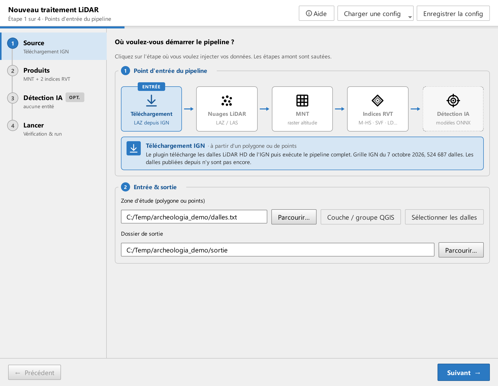
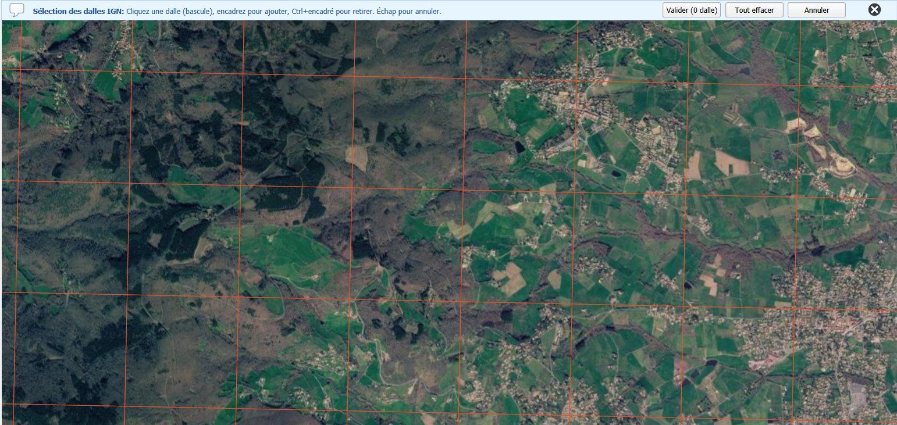

# Étape 1 · Source et mode

La frise du haut représente la chaîne de traitement. Cliquez le point d'entrée qui correspond à vos données : il fixe le **mode**, rappelé dans un bandeau, et le champ **Source** s'adapte. Il n'y a pas de liste déroulante de modes.

## Les quatre modes

| Point d'entrée | Mode | Vous fournissez | Internet |
|---|---|---|---|
| Téléchargement | IGN LiDAR HD | une zone d'étude, une liste de dalles, ou une sélection sur la carte | oui |
| Nuages LiDAR | Nuages locaux | un dossier de fichiers `.laz` ou `.las` | non |
| MNT | MNT existant | un dossier de modèles de terrain `.tif`, `.tiff` ou `.asc` | non |
| Indices RVT | Indices existants | un dossier d'indices de visualisation `.tif` | non |

Les deux premiers modes exécutent toute la chaîne. Le mode MNT existant commence aux indices. Le mode Indices existants n'a de sens qu'avec la détection : il ne calcule rien, il analyse.

Dans tous les cas, indiquez un **dossier de sortie**, de préférence vide. Relancer dans le même dossier est possible : voir [Relancer dans le même dossier](etape-4-lancer.md#relancer-dans-le-meme-dossier).

## Téléchargement IGN

Le plugin identifie les dalles LiDAR HD de l'IGN qui couvrent votre zone, les télécharge depuis la Géoplateforme, puis traite. Trois façons de désigner les dalles :

- **Sélectionner les dalles** : la grille nationale s'affiche sur le canevas de QGIS. Elle n'apparaît qu'à une échelle assez fine : zoomez sur votre secteur jusqu'à ce que les dalles soient dessinées (la barre de messages indique l'échelle requise). Cliquez une dalle pour la prendre ou la retirer, encadrez à la souris pour en ajouter plusieurs, **Ctrl** + encadrer pour en retirer, **Échap** pour abandonner. **Valider** enregistre la liste, avec une estimation du volume à télécharger.
- **Zone d'étude** : un fichier vectoriel (`.shp`, `.gpkg`, `.geojson`), polygone ou points, dans n'importe quelle projection. Toutes les dalles qui touchent l'emprise sont retenues.
- **Liste de dalles** : un fichier `.txt`, une dalle par ligne au format `nom,url`, tel que l'écrit la sélection sur carte ou tel que le fournit le site de téléchargement de l'IGN.

La grille des dalles est livrée avec le plugin et remise à jour à chaque version : les dalles publiées par l'IGN depuis la version installée n'y figurent pas encore.

Chaque dalle couvre un kilomètre carré. Les dalles voisines sont fusionnées avant le calcul des indices, avec une marge, pour que les indices se raccordent sans couture : voir [Tuilage et marge](etape-2-produits.md#tuilage-et-marge).

## Nuages locaux

Vous avez déjà les fichiers `.laz` ou `.las`. Le plugin lit le dossier, reconnaît les dalles IGN à leur nom, fusionne les voisines et applique le même traitement que le mode IGN. Les fichiers doivent être en Lambert-93.

## MNT existant

Vous fournissez un dossier de modèles de terrain. Le plugin calcule les indices cochés à l'étape 2 puis, si elle est activée, la détection. Les sections MNT et Densité de l'étape 2 sont masquées : ces produits existent déjà.

Les rasters doivent être en **Lambert-93 (EPSG:2154)**. Un raster dans une autre projection est refusé à la vérification de l'étape 4, avec un message qui le nomme : reprojetez-le avant.

Le plugin inspecte l'emprise de chaque raster :

- **dalle IGN** d'un kilomètre, alignée sur la grille : traitement habituel ;
- **petit raster**, moins d'un kilomètre ou non aligné : l'emprise est conservée telle quelle ;
- **grand raster**, plus d'un kilomètre dans une dimension : aucun pré-découpage, les indices sont calculés sur toute l'emprise et la détection découpe elle-même l'image en fenêtres d'analyse.

Chaque raster est calculé seul, sans voisin : sur un lot de petites dalles, les indices à grand rayon peuvent montrer une couture entre deux dalles. La carte **Tuilage** de l'étape 2 signale quand le rayon d'un indice dépasse ce que la dalle peut fournir.

## Indices existants

Vous avez déjà les indices de visualisation, par exemple produits par un run précédent ou par un autre outil. Le dossier est lu tel quel, les images sont préparées pour les modèles et la détection s'exécute. Même exigence de projection : Lambert-93. Les résultats sont rangés sous `indices/RVT/`, le plugin ne connaissant pas les réglages qui ont produit ces images.

Pour que les objets à cheval sur deux dalles soient vus entiers, le plugin fabrique une marge à partir des dalles voisines présentes dans le dossier. Une dalle isolée n'en a pas.

## Enregistrer et recharger une configuration

Dans l'en-tête de l'assistant, **Enregistrer la config** garde l'ensemble de vos choix sous un nom ; **Charger une config** liste les configurations enregistrées et propose **Réinitialiser** pour revenir aux réglages par défaut. Ces configurations vivent dans votre profil QGIS, pas dans le dossier du plugin : elles survivent aux mises à jour. Pendant un traitement, le chargement est désactivé.
