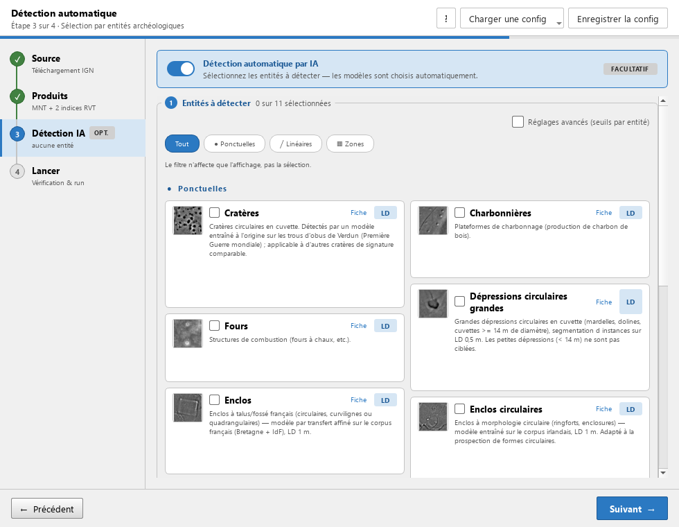
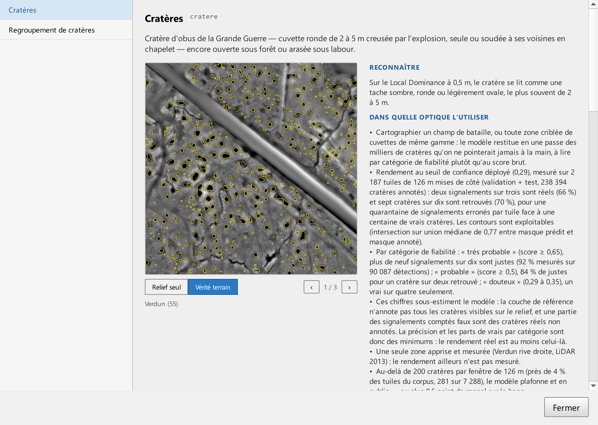

# Étape 3 · Détection

La détection est facultative : tant qu'elle est désactivée, le traitement s'arrête après les indices. Activez-la, puis cochez les **entités** à chercher. Vous ne choisissez pas de modèle : pour chaque entité, le plugin retient le modèle entraîné pour elle et l'indice de visualisation sur lequel il a appris.

## Les entités

Les entités sont groupées par morphologie. Les pastilles de filtre, au-dessus, ne changent que l'affichage, pas votre sélection.

| Morphologie | Entités |
|---|---|
| Circulaires et ponctuelles | Cratères · Charbonnières · Fours · Dépressions circulaires grandes · Enclos · Enclos circulaires |
| Linéaires | Tranchées et boyaux · Chemins creux · Parcellaire · Talus et fossés |
| Zones | Regroupement de cratères |

La liste dépend des modèles installés : une entité n'apparaît que si un modèle la couvre.

## La carte d'une entité

- **Vignette** et lien **Fiche** : à quoi ressemble la structure sur le relief, dans quel corpus et sur quel terrain le modèle l'a apprise, sa fiabilité mesurée, ce qu'il ne détecte pas, ses limites. La fiche montre aussi le **profil des scores** : les détections de l'évaluation rangées par score, les vraies en couleur et les fausses en gris, avec les coupures des quatre niveaux de fiabilité. Depuis la fiche, un lien ouvre la fiche du modèle.
- **Indice requis** : le sigle de l'indice sur lequel le modèle travaille. S'il n'est pas coché à l'étape 2, le sigle passe en orange et un bouton **+ Activer** l'ajoute.
- **Modèle** : « seul disponible », ou un menu **Changer ▾** quand plusieurs modèles couvrent l'entité. Chaque entrée du menu indique le nombre de **fenêtres d'analyse** que le modèle découpe dans une dalle : c'est un fait sur le volume de calcul, pas une estimation de durée. Le bouton **ⓘ** ouvre la fiche du modèle : architecture, seuils, métriques d'évaluation et courbes.
- **Regrouper en zones** : pour certaines entités, une case regroupe les détections proches en zones. Le **Regroupement de cratères** est une entité à part entière, avec le badge **regroupement automatique** : la cocher produit les zones et les cratères qui les composent.

## Comparer deux modèles

Quand deux modèles couvrent une entité, cochez-les tous les deux dans le menu **Changer ▾**. L'entité est détectée deux fois, une fois par modèle ; les sorties portent le nom du modèle et QGIS les charge dans un même groupe marqué « comparaison », pour les superposer.

## Seuils et réglages par entité

La case **Réglages avancés (seuils par entité)** déplie, sur chaque carte :

- **Seuil de confiance** : les détections dont le score est sous ce seuil sont écartées. Le défaut vient du modèle, fixé à son évaluation ; il est choisi un peu en dessous du point d'équilibre entre précision et rappel, parce qu'en prospection une structure manquée ne se rattrape pas alors qu'une fausse détection s'écarte en quelques secondes sur le relief. Baisser le seuil augmente le rappel et les fausses détections ; le monter fait l'inverse.
- **Aire minimale** des détections conservées, en mètres carrés.
- Pour les regroupements : distance maximale entre deux détections, nombre minimal de détections, confiance minimale pour participer au regroupement, aire minimale d'une zone, marge autour de la zone. Les enclos et les axes linéaires ont leurs propres réglages (fermeture, élongation, longueur minimale…), expliqués en infobulle.
- Le bouton **↺** d'une carte remet cette seule entité aux valeurs du modèle.

Quand le modèle est livré avec son évaluation, un **profil des scores** en miniature apparaît sous la case : les barres grises sont les fausses détections du banc d'évaluation, les barres colorées les vraies, et la ligne du seuil suit la valeur que vous saisissez. La phrase sous la figure dit ce que votre réglage change par rapport au seuil du modèle : détections correctes et fausses détections gagnées ou perdues sur le banc. Ces chiffres sont ceux du banc, sur votre terrain ils varient ; ils donnent le sens et l'ordre de grandeur d'un réglage, pas une promesse.

> Le seuil est appliqué après le regroupement : des détections sous le seuil peuvent encore contribuer à une zone, puis disparaître de la couche des détections individuelles.

## Fiabilité affichée

Un score de modèle n'est pas une probabilité, et son échelle change d'un modèle à l'autre. Dans QGIS, la légende d'une couche de détections n'affiche donc pas le score mais une **fiabilité** en quatre niveaux, mesurée à l'évaluation du modèle : **douteux**, **possible**, **probable**, **très probable**. Le mot veut dire la même chose pour tous les modèles ; seuls les scores de coupure changent, par classe. L'infobulle de la couche et son résumé dans le panneau des couches donnent la part mesurée de vrais objets pour chaque niveau. Voir [Vos résultats dans QGIS](resultats.md#la-legende-de-fiabilite).

La **fiche** d'une classe montre le profil complet : les quatre niveaux sous l'axe avec leur part mesurée et leur effectif, une ligne pointillée au point d'équilibre entre précision et rappel (le seuil du modèle est choisi en dessous), le bilan du seuil réglé, et, quand l'évaluation couvre plusieurs zones, un petit profil par zone : une classe peut être sûre dans une forêt et plus faible dans une autre. En haut à droite de la figure, la précision et le rappel mesurés au banc pour le seuil courant. La case **Tester un seuil** de la fiche déplace la ligne, recalcule les niveaux, la précision et le rappel, sans changer le seuil du traitement : c'est un essai, le seuil appliqué reste celui de la carte. Survolez une barre pour ses effectifs ; un clic droit sur la figure l'enregistre ou la copie, pour un rapport ou une présentation. En comparaison de deux modèles, la figure prend la couleur de la couche de ce modèle, comme la légende. Quand vous avez saisi des verdicts dans QGIS (voir [Valider les détections](resultats.md#valider-les-detections)), chaque niveau de la fiche ajoute « chez vous : 64 % sur vos 85 vérifications » : le banc est un plancher annoncé, le terrain dit ce qu'il vaut ici.

## Objets à cheval sur deux dalles

Les images analysées débordent de la dalle, grâce à la marge de l'étape 2 ou, en mode Indices existants, grâce aux dalles voisines du dossier. Un objet coupé par le bord est vu entier par l'une des deux dalles, et chaque dalle ne rapporte que les détections dont le centre est chez elle : pas de doublon et pas de fragment au bord.

## Récapitulatif

La carte **Runs IA programmés** liste ce qui sera lancé : un modèle, ses classes, l'indice sur lequel il travaille. Un modèle travaille toujours sur un seul indice. La case **Générer images annotées** produit en plus des images avec les détections dessinées, rangées dans la zone technique du dossier de sortie.

À la fin du traitement, le journal donne pour chaque modèle le nombre d'images analysées et la durée mesurée, pour comparer deux modèles sur un cas réel.
