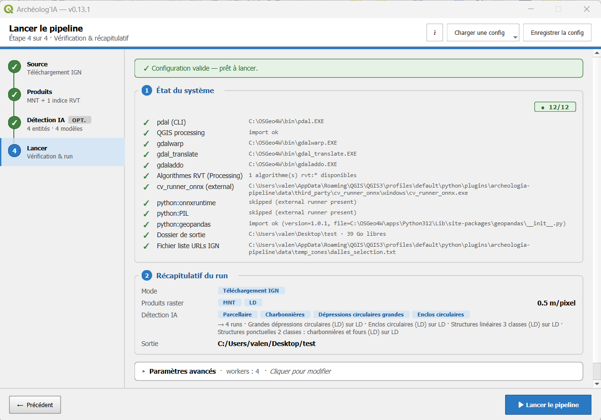
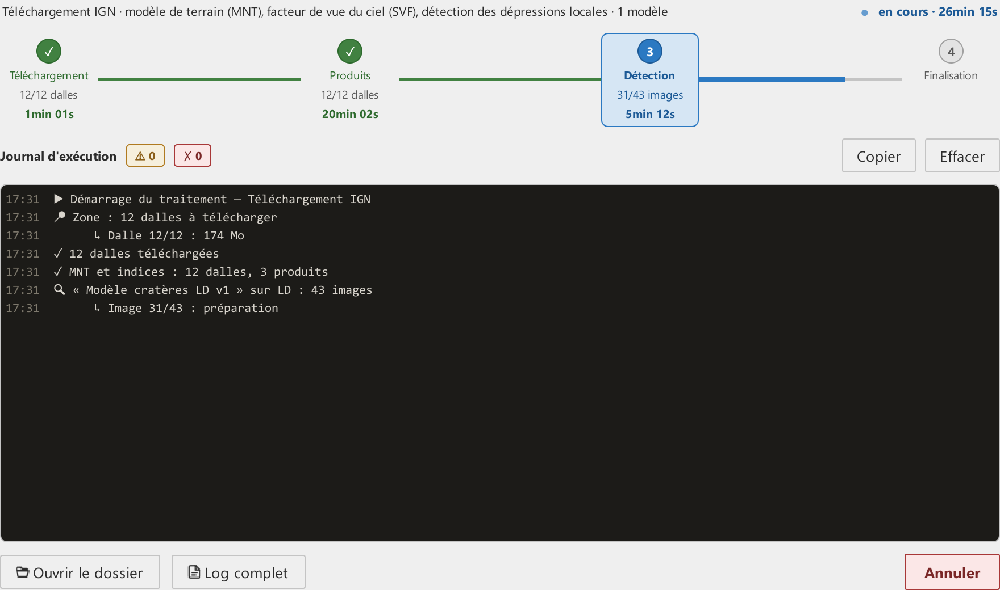

# Étape 4 · Lancer et suivre

## Avant de lancer

Le bandeau du haut dit si la configuration est valide. S'il manque quelque chose, il nomme les points à corriger et le rail de gauche pose une pastille sur l'étape concernée.

Le **récapitulatif** reprend vos choix : mode et source, produits, entités et modèles, dossier de sortie.

### État du système

Le panneau vérifie en tâche de fond ce dont le traitement a besoin :

- les outils en ligne de commande : PDAL pour les nuages de points, GDAL pour les rasters ;
- QGIS Processing et les algorithmes de Relief Visualization Toolbox ;
- le moteur de détection et ses bibliothèques, si la détection est activée ;
- les dossiers d'entrée et de sortie, et la projection des rasters en MNT ou Indices existants.

Chaque contrôle affiche son état et son détail. Un élément manquant bloque le lancement et dit quoi installer : voir [Dépannage](depannage.md#les-verifications-prealables-ont-echoue).

### Paramètres avancés

**Workers parallèles** : le nombre de dalles traitées en même temps. Plus de workers accélère le traitement sur une machine à plusieurs cœurs mais consomme plus de mémoire. Sur un poste à 16 Go, restez à deux ou trois.

## Pendant le traitement

**Lancer le pipeline** bascule l'écran sur la vue d'exécution. Avant même le lancement, elle montre ce qui a été choisi : la ligne du haut résume le mode, les produits et les modèles, et la frise annonce les phases du mode, Téléchargement, Produits, Détection, Finalisation.

- la **frise** porte l'état : la phase en cours est encadrée, avec son compteur mesuré (dalles, images) et son chronomètre ; le fil qui la suit se remplit à proportion de ce compteur, et passe au vert quand la phase est faite. Le chronomètre total est à droite de la ligne du haut ;
- le **journal** : un message par événement, dans le vocabulaire de cette aide. Les pastilles **⚠** et **✗** comptent les avertissements et les erreurs et filtrent l'affichage ; **Copier** et **Effacer** agissent sur le texte affiché.

Rien n'est estimé : une phase sans compteur montre son chronomètre, pas un pourcentage.

Pendant le traitement, les étapes 1 à 3 restent consultables mais en lecture seule, signalé par une pastille dans l'en-tête. **Annuler** arrête proprement à la fin de la dalle en cours.

### Lire le journal

- **▶ Démarrage**, puis les vérifications préalables.
- **Téléchargement** : les dalles identifiées, puis chaque dalle téléchargée.
- **Fusion des dalles avec leurs voisines** : la marge est constituée.
- **Calcul des produits** : une ligne par dalle, puis par modèle de terrain.
- **Détection** : une ligne par modèle, puis par image analysée ; à la fin de chaque modèle, le nombre d'images et la durée mesurée.
- **Assemblage** : mosaïques, GeoPackages, projet QGIS, puis le nombre de couches ajoutées.

Un **⚠** signale quelque chose qui n'arrête pas le traitement mais mérite d'être lu : un raster trop petit pour le rayon d'un indice, une dalle écartée. Un **✗** est une erreur ; si le traitement s'interrompt, le message en donne la cause et le journal complet du dossier de sortie le détail. Quand ce manuel a une rubrique pour le message, la ligne se termine par « voir Manuel › Dépannage › … » : un clic l'ouvre directement.

## À la fin

La ligne du haut devient la synthèse : « Terminé en 32min 15s · aucun avertissement », en vert ; en gris pour une annulation, en rouge pour un échec avec le nombre d'avertissements et d'erreurs. Chaque phase de la frise garde sa durée mesurée.

Sous la frise, le cadre **Par où commencer** : pour chaque entité, une barre des détections par niveau, du plus sûr au plus douteux, dans la couleur de la couche, avec son total. C'est la réponse à « par où commencer ? » : les **très probables** d'abord. Le même bilan est dans le journal et dans la trace du traitement.

Les couches **ne sont pas chargées dans QGIS automatiquement**. Le bouton **Ouvrir le projet QGIS** charge les mosaïques et les couches de détections, stylées, dans votre projet courant ; il ne le fait qu'une fois. Le projet `livrable/projet.qgs` est écrit dans tous les cas et s'ouvre aussi à la main, plus tard ou sur un autre poste.

Un **rapport** du traitement (`rapport.html`) est écrit dans `livrable/` et s'ouvre dans le navigateur avec le bouton **Rapport** du même cadre : une mise en garde d'usage, le mode, la surface couverte et le nombre de dalles, les produits avec leurs réglages en mots, chaque modèle sous son nom avec le seuil appliqué, le nombre d'images analysées et la durée mesurée, le bilan de fiabilité avec ce que garantit chaque niveau et la densité de détections au km², les durées par étape, les avertissements du journal avec leur renvoi au manuel, les sources des données et des outils, et une vignette de la zone. Il ne situe pas la zone : aucun nom de dalle, aucune coordonnée, aucun chemin de votre poste, et les avertissements sont débarrassés de leurs chemins. Il se lit hors ligne et s'imprime : c'est le document à joindre au dossier de prospection.

En bas, **Ouvrir le dossier** ouvre le dossier de sortie et **Log complet** le journal détaillé.

Ce que contient le dossier et comment lire les couches : [Vos résultats dans QGIS](resultats.md).

## Relancer dans le même dossier

Vous pouvez relancer un traitement dans un dossier de sortie déjà utilisé, par exemple pour ajouter un indice ou une entité :

- un produit déjà calculé avec les mêmes réglages n'est pas recalculé ;
- un indice relancé avec d'autres réglages va dans un dossier distinct, dont le nom porte les réglages ;
- les mosaïques sont régénérées et les couches périmées retirées du projet QGIS au lancement, pour que les nouvelles dalles apparaissent.

Les sorties intermédiaires ne sont jamais supprimées par le plugin : vous pouvez les effacer vous-même une fois satisfait, voir [Faire de la place](resultats.md#faire-de-la-place).

Un dossier de sortie écrit par une version précédente du plugin est réorganisé en `livrable/` et `technique/` au lancement, après votre accord : voir [Vos résultats dans QGIS](resultats.md).
