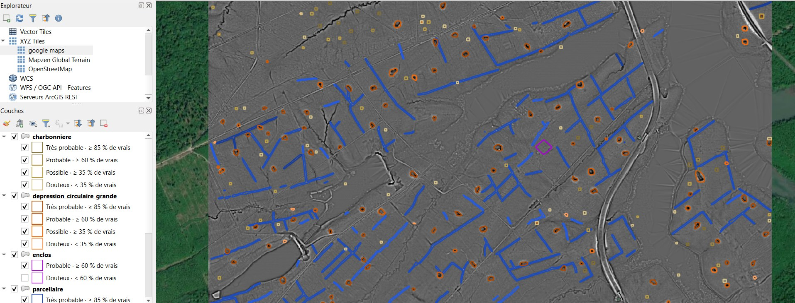

# Vos résultats dans QGIS

## Le dossier de sortie

```
dossier_de_sortie/
├── metadata.json                      résumé du traitement et configuration complète
├── pipeline_log_AAAAMMJJ_HHMMSS.txt   journal détaillé, un par lancement
├── sources/                           dalles LiDAR téléchargées ou copiées
├── intermediaires/                    fichiers techniques par dalle, supprimables
├── indices/
│   ├── MNT/tif/                       le modèle de terrain, dalle par dalle
│   │   └── index_MNT.vrt              la mosaïque, chargée dans QGIS
│   ├── SVF_R10_D16_V1_N0/tif/         un indice, avec ses réglages dans le nom
│   │   └── index_SVF.vrt
│   └── …/png/                         images préparées pour la détection
└── detections/
    ├── detections_validation.qgs      le projet QGIS, tout regroupé et stylé
    ├── parcellaire/parcellaire.gpkg   un GeoPackage par entité
    ├── parcellaire/fiabilite.json     les coupures de fiabilité de cette couche
    └── _technique/<modèle>/           sorties brutes et images annotées
```

Trois familles :

- **sources** : vos données d'entrée, telles que reçues ;
- **intermédiaire** : `intermediaires/` et `detections/_technique/`, régénérables, utiles seulement pour comprendre un problème ;
- **résultat** : `indices/…/tif/`, les mosaïques `index_<PRODUIT>.vrt`, les GeoPackages de `detections/` et le projet `.qgs`.

### Le nom d'un dossier d'indice

Le dossier d'un indice porte ses réglages : `SVF_R10_D16_V1_N0` est un facteur de vue du ciel à rayon 10 pixels, 16 directions, exagération 1, sans suppression de bruit ; `LD_A15_Rmin10_Rmax20_H1p7_V1` une dominance locale avec ses rayons et sa hauteur d'observation. Relancer avec d'autres réglages crée un autre dossier au lieu d'écraser le premier. Le MNT, la densité et la couverture n'ont pas de réglage : leur dossier porte le nom seul. En mode Indices existants, tout va sous `indices/RVT/`.

Dans chaque dossier `tif/`, la mosaïque `index_<PRODUIT>.vrt` assemble toutes les dalles : c'est elle que QGIS charge, sous le même nom. Chargée à la main, elle reste reconnaissable.

## Le projet de validation

`detections/detections_validation.qgs` est écrit à la fin de chaque traitement et constitue le point d'entrée pour valider les détections. Il contient les mosaïques des indices et, par entité, un groupe avec sa couche de détections stylée. Deux modèles comparés sur une même entité donnent deux couches dans un groupe marqué « comparaison ».

Les mêmes couches sont chargées directement dans votre projet QGIS courant à la fin du traitement.

## La légende de fiabilité

Chaque couche de détections est catégorisée en quatre niveaux : **douteux**, **possible**, **probable**, **très probable**. Un niveau est défini par la part de vrais objets mesurée à l'évaluation du modèle dans la bande de scores correspondante : au moins 35 % pour possible, 60 % pour probable, 85 % pour très probable. Le mot veut donc dire la même chose pour tous les modèles ; seuls les scores de coupure changent.

Le dessin : contour seul, sans remplissage, pour laisser lire la structure détectée dessous ; une couleur par classe, déclinée du plus foncé (très probable) au plus clair (douteux). L'infobulle de la couche et son résumé, dans les propriétés, donnent la part mesurée pour chaque niveau et le nombre de détections sur lequel elle a été mesurée.

[](img/resultats-legende-fiabilite.jpg)

Une couche issue d'un modèle sans fiabilité mesurée est catégorisée par tranches de score.

## Les attributs d'une détection

| Attribut | Contenu |
|---|---|
| `model_pred` | la classe prédite par le modèle |
| `confidence` | le score du modèle, entre 0 et 1 |
| `fiabilite` | le niveau de fiabilité affiché dans la légende |
| `fiabilite_pct` | la part de vrais objets mesurée pour ce niveau, en pour cent |
| `conf_bin` | la tranche de score, pour les modèles sans fiabilité mesurée |
| `model_name` | le modèle qui a produit la détection |
| `cluster_id` | le regroupement auquel la détection appartient, le cas échéant |
| `corr_pred`, `validation` | deux champs vides, à votre usage pour corriger la classe et noter votre verdict |

Les zones issues d'un regroupement portent en plus le nombre de détections qu'elles contiennent, leur surface en mètres carrés et leur densité par hectare.

## Valider les détections

Ouvrez le projet de validation, parcourez une couche de détections avec l'indice sur lequel le modèle a travaillé en dessous, et renseignez `validation` au fil de l'eau. Les détections **douteux** valent le coup d'œil mais rarement plus : en prospection, une fausse détection s'écarte en quelques secondes, une structure manquée ne se rattrape pas, c'est pourquoi le seuil par défaut laisse passer cette catégorie.

Pour une dalle, les détections de toutes les entités se superposent sans doublon aux bords : chaque dalle ne rapporte que les objets dont le centre est chez elle.

## Le fichier metadata.json

À la racine du dossier de sortie, il documente le traitement : version du plugin, date, dalles traitées, produits et leurs réglages, modèles lancés, entités produites avec le chemin de leur GeoPackage, et la configuration complète de l'assistant. Il sert de trace pour l'archivage et permet de rejouer un traitement à l'identique.

## Faire de la place

Une fois le traitement validé, vous pouvez supprimer sans perdre de résultat :

- `intermediaires/` en entier ;
- `detections/_technique/` ;
- les dossiers `png/` des indices, régénérables depuis les `tif/`.

Gardez `indices/…/tif/` avec leurs mosaïques, les GeoPackages, le projet `.qgs` et `metadata.json`. Sur Windows, un dossier de sortie très profond peut dépasser la limite de 260 caractères d'un chemin : choisissez un dossier de sortie court.
